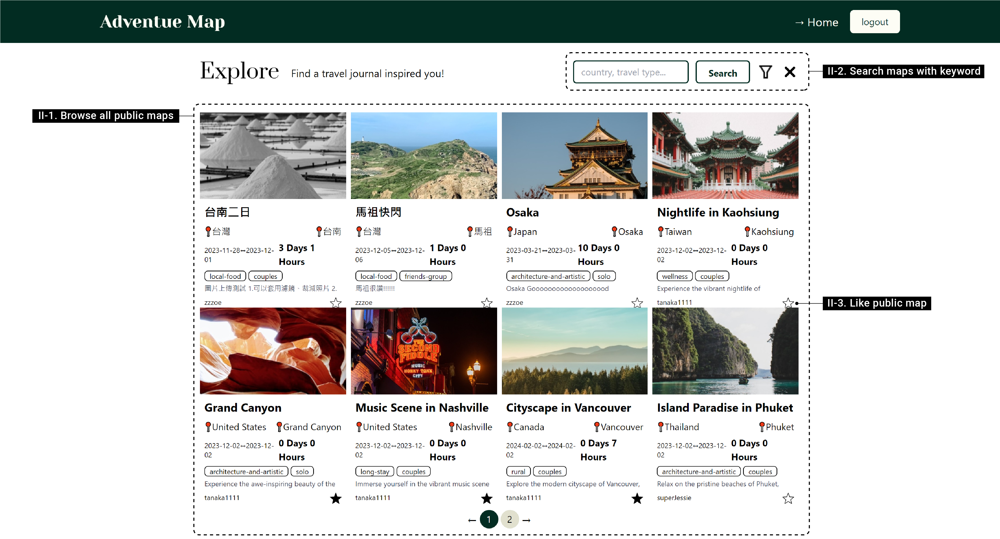

Adventure Map is a solo project, independently developed from end to end over the course of approximately two months, spanning from November to December of 2023.

>View Adventure Map [here](https://adventure-map-rho.vercel.app/) 

>Testing Account:

- email: zoey1111@gmail.com 

- password: 123456

## About

>The initial concept behind the project was to create an application enabling users to document every moment of their journeys on a map, essentially crafting a travel journal in map form. Users is able to explore public journals, gaining inspiration for their own travels.

>The journey of development is quiet fun but also challenging. Numerous considerations came into play, such as optimizing user experience, determining user interactions with the map, deciding when to store data, and presenting geographical information on the map with a stylistic approach. Managing these elements within a defined time frame added an extra layer of complexity. It’s like infinite loops one after one, idea, research, implement, test and revise and then jump into another loop.

>For the past two months, I have been developing the basic features of an Adventure Map. Although there are still many details to improve, I am quite satisfied with the results so far.

Let’s go check it out!

## Intro

>Adventure Map is an app for creating travel journal on the map.

- The main feature is that user can add spot, route on the map. Besides document for the travel details, for each element on the map can also document like date time period, location, description of the travel and also upload image for that spot or route.

- The other two features are exploring other’s public map and user can manage their own maps and liked maps in thier home page.

## Techniques
**The word "feature" in this section means the mark on the map. Ex: spot feature, route feature, geometry feature.

### Architecture
- Frontend: React, OpenLayers, TypeScript, Tailwind Css
- Backend: Next.js API endpoint, Prisma, NextAuth.js
- Serverless service: MongoDB Atlas, AWS S3
- Fullstack Framework: Next.js(SSR, production files optimization)
- Host: Vercel
- Third-API: Nominatim(geocoding), mapTiler

### Map Component 
Three type of components for display and modify feature informations.
- Information Components: Show up when selecting feature or create feature. Related data can be set and modify in these components.
- Image Preview Components: When uploading or updating image for feature, this component show up, after uploading or updating image, the update image will show up in the related information component.
- Tool Components: Tool components are for manipulating features on the map. 
  -  Ex1: Creating, selecting, and deleing features.
  -  Ex2: Showing search result geometry.
  -  Ex3: Changeing map tile.

[Components position in view](./public/readme/technical/am-technique-componentInView.jpg)
### Map Layers
Six layers for storing and display features.
- Base layer: Show map tiles, default one is openstreetmap map tile, and it can be changed with tiles get from maptiler.
- Spot layer: The created spot feature will store in this layer.
- Route layer: The created route feature will store in this layer.
- Geometry layer: The created geometry feature will store in this layer.
- Selected layer: For displaying the current selected feature boundary.
- Search layer: For displaying the search reasult geometry from geocoding. 

### Related document
- [Database ERD Link](./public/readme/technical/ERD.png)

## Features

### I. Create Map Journal
  

- I-1. Add journal information.

  User can record journal title, travel country, type and member type, write down some description about the journey, and upload the image as the main photo of the journal.
- I-2. Create spot, route, geometry on the map.
    
    For each travel journal, user can create spot, route, geometry element on the map and record relative information, like title, time period, etc.
- I-3. Selected element can be edit.
    
    After creating the element on the map, when user select it, the selected element can be edit, and also be deleted from the map.

    **To make selected feature can be edited, like change style, which can not be work in Openlayers. I store the changed style in the feature object, and apply the changed style on the feature after not selected.

- I-4. Search location/ Save view/ Publish map
    - User can find location with name, like taipei101, Taiwan, etc. When click on the search result, the location geometry will be render on the map.
    - Save current view, map zoom and center for revisiting view.
    - Publish map for sharing journal to all visitors of Adventure Map.
- I-5. Control map view/ Change base map style
    
    User can zoom in and out, set map to user current location and when selecting element on the map, the view will get the element as view center.

- I-6. Add Image for map, spot and route element in map.
    

    The image preview page is the mimic of Instagram image upload page.

    - Step1. Select image from local folder.
    - Step2. User can crop image and add filter
    - Step3. Upload it and it will immediately show on the map, spot or route page.
    
    ** To control the upload image size and make sure it's clear enough to view in the application. I redraw the image with canvas after user select it from local repository, make sure it is 400px * 500px and make the selected image center in the preview frame.

    
### II. Explore Public Maps

### III. Manage user Maps

